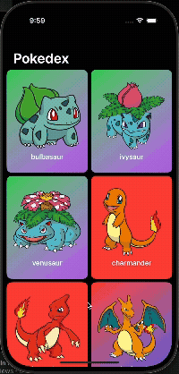

# 📱 Pokedex

A simple yet visually appealing Pokédex app built with **SwiftUI** and **Xcode**.
This project is intended **for educational purposes only**.

> Created at the request of my friend **[@joebertcerezo](https://github.com/joebertcerezo)**.

---

## 📱 App Preview

<table>
<tr>
<td>

</td>
<td>

**Tech Stack**

- 🛠 **Xcode** 16.4
- 💻 **Swift** 5
- 🎨 **SwiftUI**
- 📦 **Factory** (Dependency Injection)
- 🖼 **SVGView** (SVG Rendering)

</td>
</tr>
</table>

---

## 📚 Libraries Used

1. [**SVGView**](https://github.com/exyte/SVGView)
   Used to render **SVG** images provided by the [PokeAPI](https://pokeapi.co/).

2. [**Factory**](https://github.com/hmlongco/Factory)
   Used for container-based **dependency injection**.

---

## 🏛 Architecture

This project follows the **Clean Architecture** principles by [Robert C. Martin](https://en.wikipedia.org/wiki/Robert_C._Martin).

### Clean Architecture Diagram

---

## ⭐ Support

If you enjoyed this project, please consider **starring this repository** to show your support!
